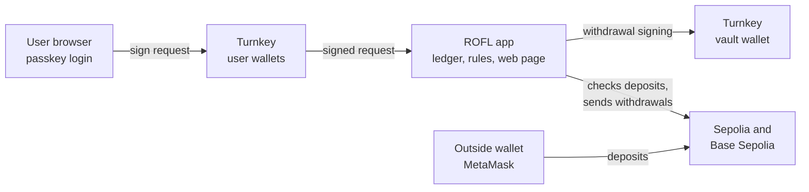
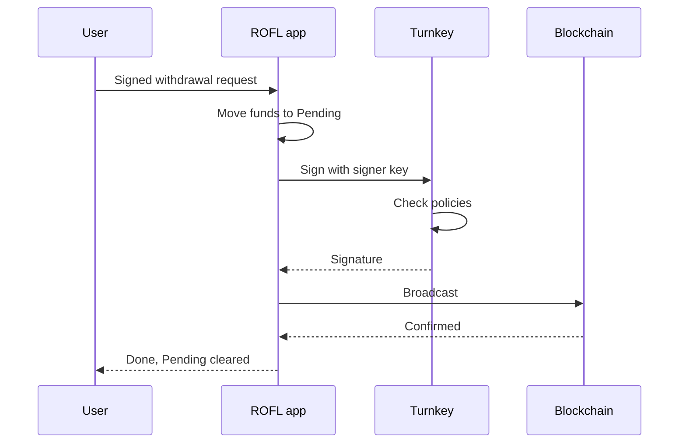

# Turnkey Crossroads Demo: Scope of Work

> Snapshot of the living Scope of Work. The editable version is a Claude Doc (link in docs/sessions/T01_CONTEXT.md). Re-export here at each session close-out so the repo copy never drifts far.

Sep 23, 2026 · @Will

## Purpose and success criteria

Build a working demo of Crossroads with Turnkey as the signing layer and an Oasis ROFL app as the verifiable ledger, ready before the CEO interview with Bryce (expected the week of Sept 28).

The demo has two jobs. It gives Will hands-on experience building with the Turnkey API, so he can hold his own on technical calls. It also shows Bryce a running example of Turnkey powering key encumbrance, the idea from the Liquefaction paper that Turnkey's own whitepaper cites.

**Must have** (the demo is usable with only these):

1. A user signs up with a passkey and gets a Turnkey wallet in seconds, with no browser extension.
2. The user deposits Sepolia ETH into their Turnkey-held deposit address and sees their balance credited in the app.
3. The user sends part of that balance to another user inside the app, confirming with their passkey. It settles instantly, with no blockchain transaction.
4. The user withdraws to an outside wallet, and Turnkey signs the withdrawal only after the app approves it.
5. A proof screen shows that no person, including Will, can sign with the vault keys. Only the attested ROFL app can.

**Target** (what makes it a Crossroads demo rather than a wallet demo):

6. Base Sepolia ETH works the same way, from the same vault address, so the app holds one balance across two chains.
7. A user swaps Sepolia ETH for Base Sepolia ETH inside the app instantly, then withdraws on Base.

**Deferred:** Solana. Cut to protect the timeline. The vault wallet can add a Solana address with one Turnkey call, so it can come back later without changing the design.

**Constraints:** free testnets and free tiers only, one operator (Will), functional over polished, and every step explainable by Will in plain terms.

## How encumbered wallets work

An encumbered key is one that no person knows or controls: a program generates it and decides every signature it makes. Everything in this demo exists to preserve that property while letting many users share one address safely.

The rules below come from the [Liquefaction paper](https://arxiv.org/abs/2412.02634) and the [Crossroads paper](https://arxiv.org/abs/2607.06525). The [Crossroads code](https://github.com/trate3/crossroads) is the blueprint for rules 4 through 8, so the app follows logic the researchers already built and tested.

| # | Rule | Where it comes from | How the demo applies it |
| --- | --- | --- | --- |
| 1 | No person ever knows the key | Liquefaction: the key is generated by an application that controls its whole lifecycle | Turnkey generates keys inside its secure hardware. Nobody exports them. |
| 2 | A program, not a person, is in charge | Liquefaction: when the "access manager" is a program, the wallet is autonomous | The ROFL app is the only user allowed to act in the Turnkey account that holds the keys. |
| 3 | Funds are pooled, and each user owns a slice | Liquefaction sub-balances; Crossroads pooled accounts | All deposit addresses belong to one Turnkey wallet. The app's ledger tracks each user's share of the pool. |
| 4 | Every deposit must say who it is for | Crossroads "transaction binding," and its per-user deposit address optimization | Each user gets their own deposit addresses, created through Turnkey on first login, so any wallet can deposit with no special tagging. |
| 5 | Only final deposits count, and each counts once | Crossroads deposit flow | The app confirms each deposit with two independent network providers and records it as used. |
| 6 | Lock funds before any signature | Crossroads lock, check, confirm sequence | A withdrawal first moves funds from "available" to "pending." Only then does the app ask Turnkey to sign. |
| 7 | No signing ahead of time, and no replaying old requests | Liquefaction pre-signing attack; Crossroads epochs | Each withdrawal uses the address's current transaction number, and every user request carries a sequence number the app checks, so nothing signed can be reused later. |
| 8 | The person withdrawing pays the network fee | Crossroads withdrawal accounting | The fee comes out of the user's locked amount. |
| 9 | Anyone can always withdraw what they own | Crossroads soundness guarantee | The app checks that on-chain funds always cover everyone's ledger balances, and the proof screen shows it. |

## Architecture

Three pieces: Turnkey holds every key (each user's wallet and the shared vault), one ROFL app keeps the ledger and makes every decision, and a web page served by that same app is what users see.

Turnkey appears twice, in two different roles. Each user has their own Turnkey wallet, owned by their passkey, which signs every trade, transfer, and withdrawal request. The vault is a separate Turnkey wallet owned by the app, which signs the actual on-chain withdrawals. Users never touch the vault, and the app never touches a user's key.

**The web page lives inside the app.** ROFL's [port proxy](https://docs.oasis.io/build/rofl/features/proxy/) gives the app a public HTTPS address, with encryption ending inside the enclave so the machine's operator cannot read or alter traffic. The page is served from the same attested program that runs the ledger.

**How each Crossroads component maps to the demo:**

| Crossroads component | What it does in the paper | In this demo |
| --- | --- | --- |
| Signing committee | Three servers jointly hold keys and sign | Turnkey, with the vault keys in its secure hardware |
| Backend blockchain and asset contracts | Keep balances and rules on-chain | The ROFL app's ledger |
| User accounts | Backend-chain keypairs that authorize withdrawals | Turnkey embedded wallets, one sub-organization per user, owned by a passkey |
| canSign check | Contract says yes or no to each signature | The app's withdrawal approval step |
| Oracles | Confirm deposits and withdrawals are final | The app asks two independent network providers |
| Encumbered addresses | One pooled address per chain, plus optional per-user deposit addresses | One vault wallet holding a deposit address for every user, valid on both Sepolia and Base Sepolia |
| Access manager (Liquefaction) | The party allowed to set the key's rules | The ROFL app, as the only user in the Turnkey account holding the vault keys |
| Chain-agnostic wallet (Crossroads application 1) | One key controls assets on every chain | The user's passkey, through Turnkey, controls one balance spendable on either chain |

## Turnkey setup

Turnkey is set up two ways. Each user gets a standard embedded wallet: a sub-organization of their own, owned by their passkey, that Will's organization can see but not use. The vault is a separate sub-organization whose only members are two keys generated inside the ROFL app. Parents get [read-only access](https://www.turnkey.com/blog/create-sub-orgs-resources-policies) to their sub-organizations by default, which covers both.

**User wallets.** On sign-up, the app's web page walks the user through creating a passkey, then asks Turnkey to create a sub-organization with that passkey as root user and one wallet with an Ethereum-style address. That address is the user's account ID on the ledger. Every request the user makes is signed by that wallet, through Turnkey, with the passkey approving it in the browser. This is the same flow Turnkey's consumer customers use, and the app never holds any user's key.

**The vault.** The rest of this section describes the vault sub-organization.

**Two app keys, two jobs.** Turnkey's [root users can bypass the policy engine](https://docs.turnkey.com/concepts/users/root-quorum), so the app uses a root key only for setup and a separate, policy-limited key for everyday signing. Both come from ROFL's [key generation](https://docs.oasis.io/build/rofl/features/appd), which only works inside an attested app and returns the same key every time the app restarts.

| App key | Turnkey role | Can do |
| --- | --- | --- |
| Admin key | Sole root user of the sub-organization | One-time setup: create the vault wallet, the signer user, and the policies |
| Signer key | Ordinary user, zero permissions except its policies | Sign withdrawals from the vault wallet, within the limits below |

**Setup sequence:**

1. The app starts in ROFL, generates both keys, and shows their public halves on its status page.
2. Will runs a one-time setup script with his parent-org credentials that creates the sub-organization with the app's admin key as its only root user.
3. The app, acting as admin, creates the vault wallet and the signer user. Deposit addresses are added to the vault wallet later, one per user, the first time each user signs up. The same address works on Sepolia and Base Sepolia.
4. The app, still as admin, creates the signer's policies. After this, the admin key is used only to read status and to add deposit addresses.

**Signer policies** (Turnkey denies anything not explicitly allowed):

- Sign Ethereum transactions only from the vault wallet and only on Sepolia (chain 11155111) or Base Sepolia (chain 84532), following Turnkey's [policy examples](https://docs.turnkey.com/concepts/policies/examples).
- Cap each withdrawal at 0.05 ETH.
- Nothing else: no key export, no new users, no policy changes.

The caps are a circuit breaker. Even if the app had a bug, Turnkey itself would refuse a withdrawal above the limit.

**What Will can and cannot do.** He can see the vault's addresses, balances, and signing history from his parent organization. He cannot sign, export, or change anything in the sub-organization. The app's users will have no email or phone attached, so there is nothing for parent-initiated recovery to target. Phase 1 confirms this by having Will try to sign, through the dashboard or the API, and fail. One power the parent does keep: it can delete the sub-organization, which would destroy the keys. That is a way to lose funds, not steal them, and it is listed under simplifications.

**Every Turnkey call in the demo**

Two kinds of signing happen. Every API call is signed by the caller's own API key so Turnkey knows who is asking; that is authentication and costs nothing. Signing a transaction with a wallet key is the billable kind and counts against the monthly allowance. Exact activity names are confirmed during the build.

| When | Turnkey call | Who calls it | Billable signature | What it demonstrates |
| --- | --- | --- | --- | --- |
| Setup, once | Create sub-organization (vault), with the app's admin key as sole root user | Will's setup script, using his parent credentials | No | Sub-organization isolation; API-key-only users; root quorum |
| Setup, once | Create wallet (the vault) | App, as admin | No | HD wallets: one seed, many addresses |
| Setup, once | Create user (the signer) with its API key | App, as admin | No | Least-privilege service users |
| Setup, once | Create policy, two or three times | App, as admin | No | The policy engine: allow-lists by wallet, chain, and amount |
| Setup, once | Get organization / who am I | App, as admin | No | Confirms the root quorum is the app alone |
| Each user sign-up | Create sub-organization (user), with the user's passkey as root user and one wallet inside it | App, with a parent-org key limited to this one action | No | Embedded wallets; passkeys; non-custodial user accounts |
| Each user sign-up | Create a wallet account in the vault: one Ethereum address, used on both chains | App, as vault admin | No | Deposit addresses on demand; one address, two chains |
| Each user login | Passkey login to the user's sub-organization | User's browser | No | Passkey authentication |
| Each trade, transfer, or withdrawal request | Sign message with the user's wallet, approved by passkey | User's browser | Yes | User-owned keys authorizing off-chain actions |
| Each withdrawal | Sign transaction (Sepolia or Base Sepolia) from the vault | App, as signer | Yes | Policy-checked signing on either chain; the app never sees the key |
| Try to break it | Sign transaction above the cap | App, as signer | Refused before signing | Turnkey enforces the limit even when the app asks |
| Proof page, on every load | Get users, get policies, get wallet accounts, get activities | App, as vault admin | No | Full audit trail readable by API |
| Proof page, live on the call | Any signing attempt from the parent organization against the vault | Will | Refused | Parent access is read-only |

**Signature budget:** every trade, transfer, and withdrawal request is now a billable signature from the user's wallet, plus one vault signature per withdrawal. A full walkthrough uses about 8 to 10. Two rehearsals plus the real call will exceed the 25 free signatures, so expect $5 to $10 on pay-as-you-go. This is by design: the meter now matches the activity, which is the business-model point below.

**Turnkey features deliberately not used**, with the one-line reason to have ready:

- Solana signing: deferred for time. Adding it is one call to create a Solana address in the vault, plus a policy.
- Email and OAuth login: passkeys alone keep the sign-up flow to one step on camera.
- Key export and import: never called, because encumbrance depends on the vault key never leaving Turnkey.
- Gas sponsorship: the vault pays its own fees from the withdrawing user's balance.
- Turnkey Verifiable Cloud: waitlisted. ROFL stands in for it, and the app is built to move over unchanged.

**Cost:** the [free plan](https://turnkey.com/pricing) includes 25 transactions per month and up to 100 wallets. Each demo user is one wallet, and rehearsal signatures beyond 25 are $0.10 each on pay-as-you-go.

## The ROFL app

One program, written in TypeScript because both Turnkey's SDKs and ROFL's client library support it, does five jobs: identify users, keep the ledger, confirm deposits, run trades, and process withdrawals.

**Identifying users.** A user's account is the address of their Turnkey wallet. Every request (trade, transfer, withdrawal) is a message that wallet signs, with the user approving through their passkey. It costs no gas and sends nothing on-chain, but it is a Turnkey signature, so it counts against Turnkey's allowance. Each message carries the account's next sequence number, and the app rejects any message whose number it has already seen, so a captured request cannot be replayed. Crossroads does not need this step because its lock happens on-chain, where the blockchain prevents replays; our ledger is off-chain, so the app must do it.

**The ledger.** For each account and each asset, the app tracks two numbers:

| Field | Meaning |
| --- | --- |
| Available | What the user can trade, transfer, or withdraw right now |
| Pending | What is locked in a withdrawal that has not confirmed yet |

It also keeps a list of deposits already credited, so none counts twice, the next sequence number for each account, and the next transaction number for each vault address.

**Confirming deposits.** The app watches every user's deposit addresses. When funds arrive, it asks two independent network providers to confirm the transaction, the amount, and the destination address, which identifies the user. It credits the account only when both agree the transaction has enough confirmations. Because each user has their own addresses, deposits can come from any wallet, including an exchange, with no special transaction building.

- Sepolia: full finality takes about 15 minutes, too slow for a live demo. The demo waits for 3 blocks (about 36 seconds) and says so on screen.
- Base Sepolia: blocks arrive every 2 seconds, so 10 blocks (about 20 seconds) is the wait.

**Trading.** Transfers between users simply move numbers on the ledger. Swaps use a simple automated pool, the same pricing formula Uniswap uses, seeded with Sepolia ETH and Base Sepolia ETH that Will deposits as the liquidity provider. Because both assets are test ETH, the pool starts near 1:1 and the price moves with trades, which makes the mechanics easy to see. Both happen instantly because nothing touches a blockchain.

**Withdrawals**, following the Crossroads lock, check, confirm sequence:

1. The user signs a request naming the chain, amount, and destination address.
2. The app moves the amount plus an estimated network fee from Available to Pending.
3. The app picks a vault address on that chain holding enough funds, the user's own deposit address first.
4. The app builds the transaction using that address's current transaction number on that chain. Withdrawals from different addresses run in parallel; Crossroads needs a one-at-a-time rule only because its users broadcast for themselves.
5. The app asks Turnkey, using the signer key, to sign it. Turnkey checks its policies before signing.
6. The app broadcasts the transaction, waits for confirmation, clears Pending, and refunds any unused fee.

Because the app broadcasts immediately and each signature is tied to the current transaction number, no one can collect a signature now and use it later.

**Solvency check.** After every change, the app adds up the real on-chain balances of every vault address and compares the total with everyone's Available and Pending combined. On-chain funds must always cover the ledger. The proof screen shows both numbers.

**Saved state.** The ledger is written to ROFL's encrypted persistent storage after every change, which survives restarts and app upgrades. Network provider addresses are stored as ROFL secrets. There are no Turnkey credentials anywhere outside the enclave.

## User flows

Six flows, each short enough to show live. Only deposits and withdrawals touch a blockchain; everything in between is instant.

**Deposit**

1. **Sign up** (once): the user picks a name and creates a passkey. Turnkey creates their wallet, and the app creates their deposit address in the vault. The page shows the address with a copy button and notes it works on both Sepolia and Base Sepolia.
2. **Deposit:** they send test ETH to that address on either chain from any outside wallet, such as MetaMask or an exchange.
3. The page shows confirmations counting up, then "Credited," and the balance appears under the right chain.

**Transfer to another user**

1. The user enters a recipient's account address and an amount, then approves with their passkey. Their Turnkey wallet signs the request.
2. Both balances update immediately. No gas is spent and nothing appears on-chain.

**Swap**

1. The user picks Sepolia ETH to Base ETH (or the reverse) and an amount. The page shows the quote from the pool.
2. They approve with their passkey. Balances update immediately.

**Withdraw**

The user sees three states: Pending, Sent (with an explorer link), and Complete.

**Proof screen**

A single page anyone can open, built for the Bryce conversation. Everything on it is fetched live, not typed in:

1. **Attestation:** the ROFL app ID, the exact code version running, and a link to its registration on the Oasis explorer.
2. **Who controls the keys:** the Turnkey sub-organization's users (app admin, app signer), its root quorum (app admin only), and the signer's policies, read directly from Turnkey.
3. **Solvency:** the vault's on-chain balances beside the ledger totals.
4. **Signing history:** recent Turnkey signing activity, each linked to its on-chain transaction.

## UI and UX

One page for trading, a narration panel beside it, and a separate proof page, designed for screen-sharing on a desktop call. Two visual ideas carry the whole demo. First, every action is labeled either **Instant** (ledger only) or **On-chain** (with an explorer link), so the speed difference is obvious without explanation. Second, an **Under the hood** panel narrates what Turnkey is doing in real time, so Turnkey's role is visible instead of hidden behind the app.

**What the screen must make obvious about Turnkey**

1. A wallet in seconds, no extension: sign-up is a name and a passkey, and the panel shows "Turnkey created your wallet" with the activity ID before the user has finished reading it.
2. Keys nobody holds: right after, "Turnkey created your deposit addresses in the vault," also with an activity ID.
3. Rules enforced outside the app: on each withdrawal the panel shows "Policy check passed: 0.01 ETH under the 0.05 cap. Signed by Turnkey in 0.4 s."
4. Turnkey saying no: a **Try to break it** button requests a withdrawal above the cap. The app forwards it, and the panel shows Turnkey's refusal. This is the single strongest moment in the demo, because the limit held even though the app asked.
5. Two kinds of key, one provider: every trade shows "signed by your wallet," every withdrawal shows "signed by the vault," and the panel names which Turnkey key did each.
6. A full audit trail: every panel entry links to the Turnkey activity and, for on-chain actions, the explorer.

**Keeping it simple:** no passwords or extensions (a passkey is the login), one asset pair, everything on one screen, two demo personas as two passkey accounts, deposits made before the call so nothing waits on camera, and no charts or settings. MetaMask appears only as the outside wallet funds come from and go to.

**Screens**

| Screen | What is on it |
| --- | --- |
| Sign up / log in | A name field and a passkey prompt. Nothing else. |
| Header | The user's name, network badges (Sepolia, Base Sepolia), a link to the proof page |
| Balances | Available and Pending for Sepolia ETH and Base ETH, the user's deposit address with a copy button, and the pool's current exchange rate |
| Action panel | Four tabs: Deposit, Swap, Send, Withdraw. Each shows a plain-language summary, then a passkey prompt. The Withdraw tab also holds the Try to break it button. |
| Under the hood | A running log of every Turnkey and blockchain interaction in plain words, with timings and links |
| Activity feed | Every action, newest first, tagged Instant or On-chain. Instant items show how long settlement took. |
| Add liquidity | Visible only to Will's account. Moves his deposited ETH on both chains into the swap pool. |
| Proof page | The four panels described under User flows: attestation, key control, solvency, signing history |

**Style:** light and dark themes, addresses in a monospace font with a copy button, amounts to four decimals, and no jargon on screen ("Waiting for 3 confirmations," not "awaiting block inclusion").

**Bryce walkthrough (about 5 minutes)**

1. **Framing (30 s):** "This is Crossroads, the design from Ari Juels' group, running on Turnkey instead of a custom signing committee, with Turnkey embedded wallets as the user accounts."
2. **Sign up (30 s):** create a fresh account with a passkey and watch the wallet and deposit address appear.
3. **Deposit (1 min):** deposit 0.01 Sepolia ETH and watch it credit. Base ETH is deposited before the call so there is no waiting on camera.
4. **Swap and send (1 min):** swap Sepolia ETH for Base ETH, then send some to the second account. Each is a passkey tap and settles instantly.
5. **Withdraw (1 min):** withdraw Base ETH to MetaMask. It arrives in seconds. Then press Try to break it.
6. **Proof (1 min):** open the proof page. Show that the only key holder for the vault is the attested app, show the signer's policies, then show Will's own Turnkey dashboard failing to sign.
7. **Close (30 s):** "Move the app from ROFL to Turnkey Verifiable Cloud and the whole thing runs on Turnkey. Solana is one more address in the vault."

**Before each demo:** pre-fund a second test account, confirm the ROFL machine rental has hours remaining, check the Turnkey signature count, and make sure the account that presses Try to break it has at least 0.07 Sepolia ETH deposited, because the app locks the funds before it asks Turnkey to sign.

## Build phases and timeline

Eight phases over seven days, with the must-have demo running in ROFL by Sep 28, 2026 and the full target demo rehearsed by Sep 30, 2026. A throwaway ROFL deployment happens on day 1 so tooling problems surface early, and the real ROFL move comes before the second chain so a complete must-have demo exists if the Bryce call lands early in the week. Base Sepolia replaces Solana as the second chain; it reuses the vault's Ethereum key and policies, so that phase is short.

| Phase | What gets built | Done when | Will's hands-on part | Target |
| --- | --- | --- | --- | --- |
| 0. Accounts | Turnkey organization, testnet funds on both chains, network provider keys, Docker Hub | Every account in the checklist below exists | All of it (about 1 hour) | Sep 24, 2026 |
| 0b. ROFL smoke test | A trivial app deployed to ROFL testnet with a public URL | The URL loads | Runs the Oasis CLI commands with guidance; this is where Docker, faucet, and rental issues surface | Sep 25, 2026 |
| 1. Turnkey foundations | Vault sub-organization, vault wallet, signer user, policies; one signed Sepolia withdrawal, run locally | A withdrawal under the cap succeeds and one over the cap is refused by Turnkey | Runs the setup script, explores the sub-organization in the dashboard, tries to sign and fails | Sep 25, 2026 |
| 2. Ledger and Sepolia | Per-user deposit addresses, deposit checking, ledger with sequence numbers, transfers, withdrawals, solvency check, basic page | Deposit, transfer, and withdraw work end to end on a laptop, with a stand-in login | Makes the first real deposit and withdrawal | Sep 26, 2026 |
| 2b. Passkey wallets | Sign-up and login with passkeys, one Turnkey sub-organization per user, requests signed by the user's wallet | Two accounts sign up, trade with each other, and every request shows in Turnkey's activity log | Creates both demo accounts and checks them in his Turnkey dashboard | Sep 27, 2026 |
| 3. Move into ROFL | Package the real app, store secrets, deploy; redo vault setup with enclave-generated keys | The must-have demo runs at a public HTTPS address with vault keys no one has seen | Repeats the CLI steps from 0b, now familiar | Sep 28, 2026 |
| 4. Base Sepolia and swaps | Base Sepolia deposits and withdrawals from the same addresses, swap pool, add-liquidity tab | A Sepolia-to-Base swap and a Base withdrawal both work in ROFL | Seeds the pool with his own deposits | Sep 29, 2026 |
| 5. Proof page and rehearsal | Proof page, Under the hood panel polish, Try to break it button | Two full walkthroughs run cleanly | Rehearses the walkthrough twice | Sep 30, 2026 |

Phase 3 repeats the Turnkey setup on purpose. The keys used on a laptop in phases 1 and 2 are stand-ins, so a fresh sub-organization is created once the real keys exist inside the enclave.

Claude writes all code and explains each phase in plain terms at the end. Will's hands-on parts are chosen so he has personally touched every Turnkey concept he may be asked about.

## Simplifications versus the papers

The demo keeps the core idea intact and cuts everything that only matters at production scale. Knowing these cuts, and what would replace them, is itself part of the interview prep.

| Area | The papers | The demo | Production would add |
| --- | --- | --- | --- |
| Who can upgrade the app | Liquefaction lets the access manager be a smart contract | Will, as the ROFL app's admin, could deploy new code that receives the same keys | Hand upgrade rights to a contract with a public delay, or remove them |
| Who can destroy the keys | Crossroads soundness means funds cannot be stolen or lost | Will's parent organization can delete the sub-organization, which would destroy the keys (a way to lose funds, not steal them) | Put that power behind a multi-party quorum or remove the parent relationship after setup |
| Where the ledger lives | Crossroads: contracts on a blockchain anyone can read | Encrypted storage inside the enclave | Periodically anchoring a fingerprint of the ledger on-chain, so an old copy cannot be restored unnoticed |
| Deposit proof | Light clients or zero-knowledge bridges | Two network providers must agree | A light client or zkBridge-style proof |
| Deposit speed | Wait for full finality, or let a third party front the funds for a fee | Sepolia credits after 3 blocks instead of about 15 minutes | Full finality plus Crossroads' fast-deposit market |
| Withdrawal throughput | Many vault addresses and third-party fillers | Per-user addresses already allow parallel withdrawals; funds sometimes need moving between addresses | Automatic rebalancing between addresses, or fillers |
| Liveness | Liquefaction has a fallback system if the TEE platform goes down | Redeploying the same app regenerates the same keys, so funds are recoverable if a machine dies | A fallback that works even if the ROFL network itself stops |
| Assets | Bitcoin, Ethereum, and Solana, including tokens | Test ETH on Sepolia and Base Sepolia only; Solana deferred | Solana (one more vault address), Bitcoin, and tokens, all of which Turnkey already signs for |
| Liquefaction features | Renting, time-limited delegation, dusting protection | Not included | Time-boxed access grants, which fit naturally on top of this ledger |

The first row is the one to raise before Bryce does. The honest answer is that encumbrance is only as strong as the app's upgrade rules, and TVC's verified-code model is exactly the place those rules would be enforced.

## Business model note

Turnkey charges per signature, so where the demo puts signatures shapes what kind of customer it represents. Two designs were considered, and the demo uses the second.

| Design | Where trades happen | Turnkey signatures per user | What Turnkey sees |
| --- | --- | --- | --- |
| Users sign with MetaMask | Ledger only; MetaMask signs authorizations for free | One per withdrawal | A large custody pool with little on the meter |
| Users have Turnkey embedded wallets | Ledger only; the user's Turnkey wallet signs each authorization | One per trade, transfer, or withdrawal, plus one vault signature per withdrawal | Every user action, and a wallet for every user |

The embedded-wallet design fits Turnkey's business today: wallets and signatures scale with users and activity. It also means the demo exercises Turnkey's main product rather than treating it only as a vault.

The open question to raise with Bryce, rather than answer for him: the ledger itself, where the trades settle, runs inside the verified app. On ROFL today, and on TVC later, that compute sits outside the signature meter. TVC has no public pricing yet, so how Turnkey intends to charge for verified compute is worth asking directly.

## Risks, open questions, and Will's checklist

The biggest schedule risk is Solana, and every risk below has a fallback that still leaves a working must-have demo.

| Risk | Fallback |
| --- | --- |
| Passkey sign-up flow takes longer than a day | Fall back to a stand-in login for the must-have demo and keep the vault side unchanged; the Turnkey story loses the embedded-wallet half but nothing else |
| Base Sepolia phase runs long | Present the Sepolia-only must-have demo; transfers between users still show instant settlement |
| ROFL testnet machine rental expires mid-demo (the Oasis-run testnet node is [rented an hour at a time](https://docs.oasis.io/build/use-cases/trustless-agent) unless topped up) | Top up before every demo and keep the laptop version ready as a backup |
| Six days of ROFL uptime needs more test tokens than the 150 starting estimate | Hit the faucet several times on day 0 and ask in the Oasis Discord if it caps out |
| Rehearsals exceed Turnkey's 25 free signatures, which they will | Add a card for pay-as-you-go; expect $5 to $10 total |
| Testnet faucets are rate-limited, and some Sepolia faucets require a small mainnet ETH balance | Request funds on day 0 and try more than one faucet; Base Sepolia ETH can also be bridged from Sepolia |
| Turnkey API keys use a standard curve and ROFL hands the app raw key material | The app derives a standard Turnkey key from that material; Phase 1 confirms Turnkey accepts it |
| One network provider is down or slow | Configure three providers per chain and require two to agree |

**Open questions**

- Does the parent organization's read-only access hold for every action, including recovery, when sub-organization users have no email or phone? Phase 1 tests this directly.
- Which exact day is the Bryce call? The phase order already protects an early date.
- Do you want to tell James Austgen or Ari about the demo once it runs? It could be a useful conversation in its own right.

**Will's checklist for Phase 0**

- [ ] Create a Turnkey account through the dashboard, secured with a passkey, and add a card for pay-as-you-go
- [ ] Get about 0.3 Sepolia ETH from a faucet into MetaMask (some faucets need a small mainnet balance; try more than one)
- [ ] Get about 0.1 Base Sepolia ETH, from a Base faucet or by bridging some Sepolia ETH through the official Base testnet bridge
- [ ] Get Oasis testnet tokens from faucet.testnet.oasis.io, choosing Sapphire; request several times, aiming for 300 or more
- [ ] Create a free account with one Ethereum network provider that serves both Sepolia and Base Sepolia
- [ ] Create a Docker Hub account, where the app's public image will live
- [ ] Install Docker and the Oasis CLI (needed on day 1 for the smoke test)
- [ ] Confirm the laptop you will demo from supports passkeys (Touch ID, Windows Hello, or a phone paired as a passkey)
- [ ] Join the TVC waitlist and mention the demo to your Turnkey contact

**Sources**

- [Liquefaction: Privately Liquefying Blockchain Assets](https://arxiv.org/abs/2412.02634) and its [code](https://github.com/key-encumbrance/liquefaction)
- [Crossroads: A Smart Contract Layer for Chain-Abstracted Assets](https://arxiv.org/abs/2607.06525) and its [code](https://github.com/trate3/crossroads)
- Turnkey: [root quorum](https://docs.turnkey.com/concepts/users/root-quorum), [policy examples](https://docs.turnkey.com/concepts/policies/examples), [sub-organizations](https://www.turnkey.com/blog/create-sub-orgs-resources-policies), [pricing](https://turnkey.com/pricing)
- Oasis ROFL: [key generation and appd API](https://docs.oasis.io/build/rofl/features/appd), [port proxy](https://docs.oasis.io/build/rofl/features/proxy/), [quickstart](https://docs.oasis.io/build/rofl/quickstart)
