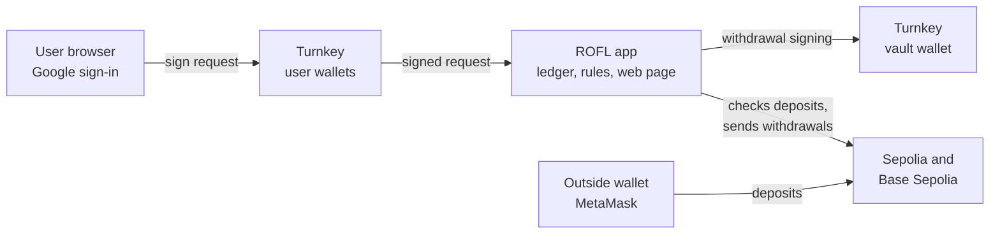
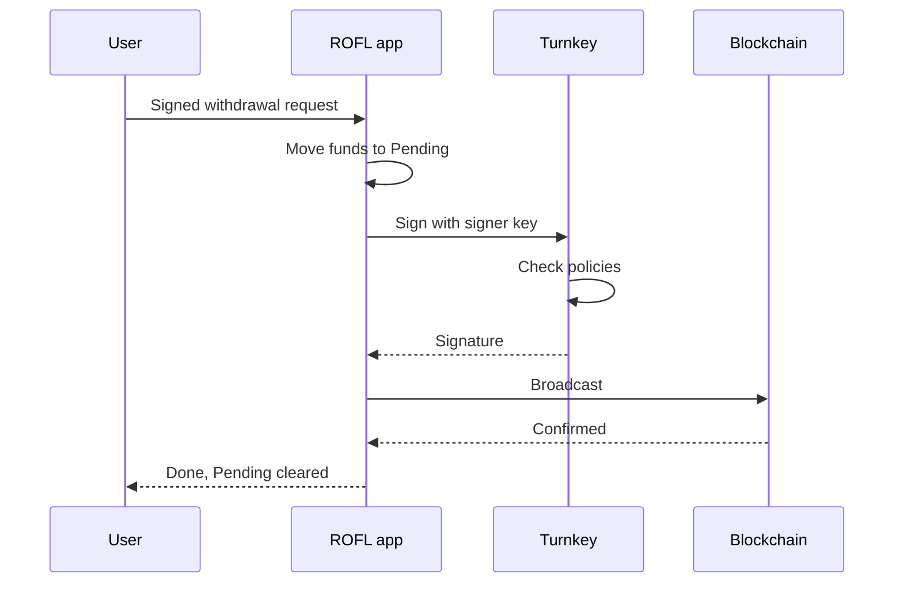

# Turnkey Crossroads Demo: Scope of Work

> Snapshot of the living Scope of Work. The editable version is a Claude Doc (link in docs/sessions/T01_CONTEXT.md). Re-export here at each session close-out so the repo copy never drifts far.

Sep 28, 2026 · @Will (Claude Doc rev 87)

## Purpose and success criteria

Build a working demo of Crossroads with Turnkey as the signing layer and an Oasis ROFL app as the verifiable ledger, ready before the CEO interview with Bryce (expected the week of Sept 28).

The demo has two jobs. It gives Will hands-on experience building with the Turnkey API, so he can hold his own on technical calls. It also shows Bryce a running example of Turnkey powering key encumbrance, the idea from the Liquefaction paper that Turnkey's own whitepaper cites.

**Must have** (the demo is usable with only these):

1. A user signs in with Google and gets a Turnkey wallet in seconds, with no browser extension.
2. The user deposits Sepolia ETH into their Turnkey-held deposit address and sees their balance credited in the app.
3. The user sends part of that balance to another user inside the app with one click. It settles instantly, with no blockchain transaction.
4. The user withdraws to an outside wallet, and Turnkey signs the withdrawal only after the app approves it.
5. A proof screen shows that no person, including Will, can sign with the vault keys. Only the attested ROFL app can.

**Target** (what makes it a Crossroads demo rather than a wallet demo):

6. Base Sepolia ETH works the same way, from the same vault address, so the app holds one balance across two chains.
7. A user swaps Sepolia ETH for Base Sepolia ETH inside the app instantly, then withdraws on Base.

**Deferred:** Solana. Cut to protect the timeline. The vault wallet can add a Solana address with one Turnkey call, so it can come back later without changing the design.

**Constraints:** free testnets and free tiers only, one operator (Will), functional over polished, and every step explainable by Will in plain terms.

## How encumbered wallets work

An encumbered key is one that no person knows or controls: a program generates it and decides every signature it makes. Everything in this demo exists to preserve that property while letting many users share one address safely.

The rules below come from the [Liquefaction paper](https://arxiv.org/abs/2412.02634) and the [Crossroads paper](https://arxiv.org/abs/2607.06525). The [Crossroads code](https://github.com/trate3/crossroads) is the blueprint for rules 4 through 8, so the app follows logic the researchers already built and tested.

| # | Rule | Where it comes from | How the demo applies it |
| --- | --- | --- | --- |
| 1 | No person ever knows the key | Liquefaction: the key is generated by an application that controls its whole lifecycle | Turnkey generates keys inside its secure hardware. Nobody exports them. |
| 2 | A program, not a person, is in charge | Liquefaction: when the "access manager" is a program, the wallet is autonomous | The ROFL app is the only user allowed to act in the Turnkey account that holds the keys. |
| 3 | Funds are pooled, and each user owns a slice | Liquefaction sub-balances; Crossroads pooled accounts | All deposit addresses belong to one Turnkey wallet. The app's ledger tracks each user's share of the pool. |
| 4 | Every deposit must say who it is for | Crossroads "transaction binding," and its per-user deposit address optimization | Each user gets their own deposit addresses, created through Turnkey at sign-up, so any wallet can deposit with no special tagging. |
| 5 | Only final deposits count, and each counts once | Crossroads deposit flow | The app confirms each deposit with two independent network providers and records it as used. |
| 6 | Lock funds before any signature | Crossroads lock, check, confirm sequence | A withdrawal first moves funds from "available" to "pending." Only then does the app ask Turnkey to sign. |
| 7 | No signing ahead of time, and no replaying old requests | Liquefaction pre-signing attack; Crossroads epochs | Each withdrawal uses the address's current transaction number, and every user request carries a sequence number the app checks, so nothing signed can be reused later. |
| 8 | The person withdrawing pays the network fee | Crossroads withdrawal accounting | The fee comes out of the user's locked amount. |
| 9 | Anyone can always withdraw what they own | Crossroads soundness guarantee | The app checks that on-chain funds always cover everyone's ledger balances, and the proof screen shows it. |

**Where the demo departs from the papers.** The Crossroads paper's base design has one encumbered address per chain, and each deposit carries a tag naming the account it credits. Per-user deposit addresses (for wallets and exchanges that cannot add the tag, later consolidated into the main address) and several addresses per chain (for withdrawal throughput) are its optional add-ons. The demo uses both add-ons without consolidation, Turnkey in place of the signing committee, embedded wallets in place of users' own keys, and a verified ROFL ledger in place of the backend chain and its contracts. For Bryce: the demo uses the paper's per-user deposit address and multi-address optimizations, with Turnkey as the signing committee and a verified ROFL app standing in for the backend chain.

**What stays private.** Deposits and withdrawals are public on their chains and link a depositor's wallet to a vault address. Trades and transfers inside the ledger never appear on-chain. The Crossroads paper claims the same exchange-level privacy. Liquefaction's privacy is a different kind: who controls an encumbered address can change with no on-chain trace. One gap in the demo: anyone with an account ID can read that account's balances from the app's API.

## Architecture

Three pieces: Turnkey holds every key (each user's wallet and the shared vault), one ROFL app keeps the ledger and makes every decision, and a web page served by that same app is what users see.

```mermaid
flowchart LR
    U[User browser<br/>Google sign-in] -->|sign request| TU[Turnkey<br/>user wallets]
    TU -->|signed request| A[ROFL app<br/>ledger, rules, web page]
    A -->|withdrawal signing| TV[Turnkey<br/>vault wallet]
    X[Outside wallet<br/>MetaMask] -->|deposits| C[Sepolia and<br/>Base Sepolia]
    A -->|checks deposits,<br/>sends withdrawals| C
```

Turnkey appears twice, in two different roles. Each user has their own Turnkey wallet, opened by signing in with Google, which signs every trade, transfer, and withdrawal request. The vault is a separate Turnkey wallet owned by the app, which signs the actual on-chain withdrawals. Users never touch the vault, and the app never touches a user's key.

**The web page lives inside the app.** ROFL's [port proxy](https://docs.oasis.io/build/rofl/features/proxy/) gives the app a public HTTPS address, with encryption ending inside the enclave so the machine's operator cannot read or alter traffic. The page is served from the same attested program that runs the ledger.

**How each Crossroads component maps to the demo:**

| Crossroads component | What it does in the paper | In this demo |
| --- | --- | --- |
| Signing committee | Three servers jointly hold keys and sign | Turnkey, with the vault keys in its secure hardware |
| Backend blockchain and asset contracts | Keep balances and rules on-chain | The ROFL app's ledger |
| User accounts | Backend-chain keypairs that authorize withdrawals | Turnkey embedded wallets, one sub-organization per user, opened with Google sign-in |
| canSign check | Contract says yes or no to each signature | The app's withdrawal approval step |
| Oracles | Confirm deposits and withdrawals are final | The app asks two independent network providers |
| Encumbered addresses | One pooled address per chain, plus optional per-user deposit addresses | One vault wallet holding a deposit address for every user, valid on both Sepolia and Base Sepolia |
| Access manager (Liquefaction) | The party allowed to set the key's rules | The ROFL app, as the only user in the Turnkey account holding the vault keys |
| Chain-agnostic wallet (Crossroads application 1) | One key controls assets on every chain | The user's Google sign-in, through Turnkey, controls one balance spendable on either chain |

## Turnkey setup

Turnkey is set up two ways. Each user gets a standard embedded wallet: a sub-organization of their own, opened with their Google sign-in, that Will's organization can see but not use. The vault is a separate sub-organization whose only members are two keys generated inside the ROFL app. Parents get [read-only access](https://www.turnkey.com/blog/create-sub-orgs-resources-policies) to their sub-organizations by default, which covers both.

**User wallets.** On sign-up, the user clicks Continue with Google, and the app asks Turnkey to create a sub-organization whose root user signs in with that Google account, with one wallet with an Ethereum-style address. That address is the user's account ID on the ledger. Every request the user makes is signed by that wallet, through Turnkey, using a short-lived session Turnkey issues at sign-in, so each action is one click. This is the same flow Turnkey's consumer customers use, and the app never holds any user's key.

**The vault.** The rest of this section describes the vault sub-organization.

**Three app keys, three jobs.** Turnkey's [root users can bypass the policy engine](https://docs.turnkey.com/concepts/users/root-quorum), so the app uses a root key only for setup and a separate, policy-limited key for everyday signing, plus a narrowly limited sign-up key in Will's organization. All three come from ROFL's [key generation](https://docs.oasis.io/build/rofl/features/appd), which only works inside an attested app and returns the same key every time the app restarts.

| App key | Turnkey role | Can do |
| --- | --- | --- |
| Admin key | Sole root user of the sub-organization | Setup (vault wallet, signer user, policies) and adding each user's deposit address. As root it could do anything; the vault lock below would end that |
| Signer key | Ordinary user, zero permissions except its policies | Sign withdrawals from the vault wallet, within the limits below |
| Sign-up key | Ordinary user crossroads-signup in Will's organization | Create sub-organizations (each user's wallet, and the vault on first start) and start Google logins. Refused anything else, confirmed live |

**Setup sequence:**

1. The app starts in ROFL, takes its three keys from ROFL's key service, and shows their public halves on its status page.
2. Will runs a one-time setup with his parent-org credentials. It registers the sign-up key as the user crossroads-signup, with one policy: create sub-organizations and start logins. Registering a new sign-up key removes every older one.
3. The app creates its own vault with the sign-up key: a sub-organization whose only root user is the app's admin key. Will's organization never touches the vault. After a move to a new machine, the app finds its vault again by asking Turnkey which sub-organization its admin key belongs to.
4. The app, as admin, creates the vault wallet, the signer user, and the signer's policies. Deposit addresses are added later, one per user at first sign-in, and work on both chains. After this the admin key only reads status and adds deposit addresses.

**Signer policies** (Turnkey denies anything not explicitly allowed):

- **Withdrawals, per network:** a plain ETH transfer from the vault wallet, up to that network's limit: 0.05 ETH on Sepolia (chain 11155111), 0.02 ETH on Base Sepolia (chain 84532). Plain means capped at 21,000 gas, so the transaction cannot call any contract, following Turnkey's [policy language](https://docs.turnkey.com/concepts/policies/language).
- **Circuit breakers:** a deny per network on anything worth more than its limit. A deny beats any allow, so it holds even if the app itself asks.
- **Aave on Base Sepolia:** supply ETH through Aave's gateway only on behalf of the vault address making the call; withdraw only back to that address; approve only Aave's gateway to take the vault's aWETH back. The vault uploads Aave's [contract interfaces](https://docs.turnkey.com/concepts/policies/smart-contract-interfaces) so Turnkey can read each call's function and arguments.
- **Never borrow:** an explicit deny on every way to open debt on Aave: borrow, flash loans, borrowing through the gateway, and credit delegation.
- Nothing else: no key export, no new users, no policy changes.

The caps are a circuit breaker. Even if the app had a bug, Turnkey itself would refuse a withdrawal above the limit.

A flat per-withdrawal cap is for the demo: it shows in one move that Turnkey enforces a rule the app cannot override. In production the check that users only withdraw what they own is the ledger's canSign step, and the Turnkey backstop would be a spending limit over time (Turnkey lists a velocity-control feature, untested), so a bad app version could only drain slowly.

**Checked on real Turnkey (Sept 28).** Every rule was tested on a throwaway vault, since deleted. A refuse-everything rule was added, then the signer asked for each allowed and forbidden transaction, and Turnkey's own per-rule verdicts were read back. Each came out as intended at no cost; one real signature confirmed a normal withdrawal still signs. What the tests showed about Turnkey's policy engine:

- It checks every clause of a rule, even after one fails. A rule that reads an argument its call lacks errors. An erroring rule does not allow, and an erroring allow does not block a signature that another rule allows (tested). By Turnkey's documented evaluation order an erroring deny would not apply either (not tested). So each Aave allow names one function and reads only its arguments, and the never-borrow deny reads no arguments at all.
- Rule names must be unique.
- Addresses compare the same in any capitalization.
- An uploaded contract interface must name every parameter, including unnamed return values.

On every start the app makes the signer's rules match this list, creating new ones before deleting old ones. If Turnkey refuses the change, the vault keeps its old rules and the proof page shows the problem.

**Vault lock (tested Sept 24, not applied).** Three calls, made by the admin key from inside the app: the signer gets permission to add deposit addresses to the vault wallet; a second root user is created whose key is thrown away; the root quorum becomes 2 of those two. On a throwaway vault, the admin's attempts to add a policy, export the wallet, add a user, or undo the lock all sat at "Consensus needed" forever; the signer still added an address and signed 0.01 ETH, and 0.06 was still refused. Irreversible: a locked vault can never change its cap or chains. Will chose to wait. It freezes the rules but not the signer, so a malicious upgrade could still withdraw within the rules.

**What Will can and cannot do.** He can see the vault's addresses, balances, and signing history from his parent organization. He cannot sign, export, or change anything in the sub-organization. The app's users will have no email or phone attached, so there is nothing for parent-initiated recovery to target. Phase 1 confirms this by having Will try to sign, through the dashboard or the API, and fail. One power the parent does keep: it can delete the sub-organization, which would destroy the keys. That is a way to lose funds, not steal them, and it is listed under simplifications.

**Every Turnkey call in the demo**

Two kinds of signing happen. Every API call is signed by the caller's own API key so Turnkey knows who is asking; that is authentication and costs nothing. Signing a transaction with a wallet key is the billable kind and counts against the monthly allowance. Exact activity names are confirmed during the build.

| When | Turnkey call | Who calls it | Billable signature | What it demonstrates |
| --- | --- | --- | --- | --- |
| Setup, once | Create sub-organization (vault), with the app's admin key as sole root user | Will's setup script, using his parent credentials | No | Sub-organization isolation; API-key-only users; root quorum |
| Setup, once | Create wallet (the vault) | App, as admin | No | HD wallets: one seed, many addresses |
| Setup, once | Create user (the signer) with its API key | App, as admin | No | Least-privilege service users |
| Setup, once | Create policy, two or three times | App, as admin | No | The policy engine: allow-lists by wallet, chain, and amount |
| Setup, once | Get organization / who am I | App, as admin | No | Confirms the root quorum is the app alone |
| Each user sign-up | Create sub-organization (user), with the user's Google sign-in on the root user and one wallet inside it | App, with a parent-org key limited to this one action | No | Embedded wallets; Google sign-in; non-custodial user accounts |
| Each user sign-up | Create a wallet account in the vault: one Ethereum address, used on both chains | App, as vault admin | No | Deposit addresses on demand; one address, two chains |
| Each user login | Google sign-in to the user's sub-organization, which issues a short-lived session | User's browser | No | OAuth sign-in and sessions |
| Each trade, transfer, or withdrawal request | Sign message with the user's wallet, through the session | User's browser | Yes | User-owned keys authorizing off-chain actions |
| Each withdrawal | Sign transaction (Sepolia or Base Sepolia) from the vault | App, as signer | Yes | Policy-checked signing on either chain; the app never sees the key |
| A withdrawal above 0.05 ETH | Sign transaction above the cap | App, as signer | Refused before signing | Turnkey enforces the limit even when the app asks |
| Proof page, on every load | Get users, get policies, get wallet accounts, get activities | App, as vault admin | No | Full audit trail readable by API |
| Proof page, live on the call | Any signing attempt from the parent organization against the vault | Will | Refused | Parent access is read-only |

**Signature budget:** every trade, transfer, and withdrawal request is now a billable signature from the user's wallet, plus one vault signature per withdrawal. A full walkthrough uses about 8 to 10. Two rehearsals plus the real call will exceed the 25 free signatures, so expect $5 to $10 on pay-as-you-go. This is by design: the meter now matches the activity, which is the business-model point below.

**Turnkey features deliberately not used**, with the one-line reason to have ready:

- Solana signing: deferred for time. Adding it is one call to create a Solana address in the vault, plus a policy.
- Passkeys and email login: Google sign-in alone keeps sign-up to one click on camera, and later actions need no extra prompt.
- Key export and import: never called, because encumbrance depends on the vault key never leaving Turnkey.
- Gas sponsorship: the vault pays its own fees from the withdrawing user's balance.
- Turnkey Verifiable Cloud: waitlisted. ROFL stands in for it, and the app is built to move over unchanged.

**Cost:** the [free plan](https://turnkey.com/pricing) includes 25 transactions per month and up to 100 wallets. Each demo user is one wallet, and rehearsal signatures beyond 25 are $0.10 each on pay-as-you-go.

## The ROFL app

One program, written in TypeScript because both Turnkey's SDKs and ROFL's client library support it, does five jobs: identify users, keep the ledger, confirm deposits, run trades, and process withdrawals.

**Identifying users.** A user's account is the address of their Turnkey wallet. Every request (trade, transfer, withdrawal) is a message that wallet signs, sent through the session Turnkey issued at sign-in. It costs no gas and sends nothing on-chain, but it is a Turnkey signature, so it counts against Turnkey's allowance. Each message carries the account's next sequence number, and the app rejects any message whose number it has already seen, so a captured request cannot be replayed. Crossroads does not need this step because its lock happens on-chain, where the blockchain prevents replays; our ledger is off-chain, so the app must do it.

**The ledger.** For each account and each asset, the app tracks two numbers:

| Field | Meaning |
| --- | --- |
| Available | What the user can trade, transfer, or withdraw right now |
| Pending | What is locked in a withdrawal that has not confirmed yet |

It also keeps a list of deposits already credited, so none counts twice, the next sequence number for each account, and the next transaction number for each vault address.

**Confirming deposits.** The app watches every user's deposit addresses. When funds arrive, it asks two independent network providers to confirm the transaction, the amount, and the destination address, which identifies the user. It credits the account only when both agree the transaction has enough confirmations. Because each user has their own addresses, deposits can come from any wallet, including an exchange, with no special transaction building.

- Sepolia: full finality takes about 15 minutes, too slow for a live demo. The demo waits for 3 blocks (about 36 seconds) and says so on screen.
- Base Sepolia: blocks arrive every 2 seconds, so 10 blocks (about 20 seconds) is the wait.

**When a provider fails.** An unanswered second opinion means try again later, never "not a deposit." Each chain lists fallback providers, tried in order; rpc.sepolia.org went dead on Sept 24 and caused one skipped deposit before this fix. A deposit a scan missed can be credited by its transaction hash, still checked by two providers and credited only once.

**Trading.** Transfers between users simply move numbers on the ledger. Swaps use a simple automated pool, the same pricing formula Uniswap uses, seeded with Sepolia ETH and Base Sepolia ETH that Will deposits as the liquidity provider. Because both assets are test ETH, the pool starts near 1:1 and the price moves with trades, which makes the mechanics easy to see. Both happen instantly because nothing touches a blockchain.

**Withdrawals**, following the Crossroads lock, check, confirm sequence:

1. The user signs a request naming the chain, amount, and destination address. Before anything is signed, the page checks the destination is a plain wallet: a plain transfer cannot reach a contract or a smart account (including a wallet upgraded with EIP-7702).
2. The app moves the amount plus an estimated network fee from Available to Pending.
3. The app picks a vault address on that chain holding enough funds, the user's own deposit address first.
4. The app builds the transaction using that address's current transaction number on that chain. Withdrawals from different addresses run in parallel; Crossroads needs a one-at-a-time rule only because its users broadcast for themselves.
5. The app asks Turnkey, using the signer key, to sign it. Turnkey checks its policies before signing.
6. The app broadcasts the transaction, waits for confirmation, clears Pending, and refunds any unused fee. The fee charged is what the chain really took, including Base's L1 data fee; a transaction that reverts still charges the fee it used.

Because the app broadcasts immediately and each signature is tied to the current transaction number, no one can collect a signature now and use it later.

**Solvency check.** The app adds up the real on-chain balances of every vault address, plus the vault's aWETH on Aave, and compares the total with everyone's Available, Pending and Earning combined. On-chain funds must always cover the ledger. The proof screen shows both numbers, and the exact shortfall if there ever is one.

**Saved state.** The ledger is written to ROFL's encrypted persistent storage after every change, which survives restarts and app upgrades. Network provider addresses are stored as ROFL secrets. There are no Turnkey credentials anywhere outside the enclave.

## User flows

Six flows, each short enough to show live. Only deposits and withdrawals touch a blockchain; everything in between is instant.

**Deposit**

1. **Sign up** (once): the user clicks Continue with Google. Turnkey creates their wallet, and the app creates their deposit address in the vault. The page shows the address with a copy button and notes it works on both Sepolia and Base Sepolia.
2. **Deposit:** they send test ETH to that address on either chain from any outside wallet, such as MetaMask or an exchange.
3. The page shows confirmations counting up, then "Credited," and the balance appears under the right chain.

**Transfer to another user**

1. The user enters the recipient's account ID or Crossroads deposit address and an amount. The page shows "Sending to <name>" before anything is signed; an address that is not a Crossroads account is refused before the wallet signs, so a typo costs no Turnkey signature. Their Turnkey wallet then signs the request.
2. Both balances update immediately. No gas is spent and nothing appears on-chain.

**Swap**

1. The user picks Sepolia ETH to Base ETH (or the reverse) and an amount. The page shows the quote from the pool.
2. They confirm. Balances update immediately.

**Withdraw**

```mermaid
sequenceDiagram
    participant U as User
    participant A as ROFL app
    participant T as Turnkey
    participant C as Blockchain
    U->>A: Signed withdrawal request
    A->>A: Move funds to Pending
    A->>T: Sign with signer key
    T->>T: Check policies
    T-->>A: Signature
    A->>C: Broadcast
    C-->>A: Confirmed
    A-->>U: Done, Pending cleared
```

The user sees three states: Pending, Sent (with an explorer link), and Complete.

**Proof screen**

A single page anyone can open, no sign-in, linked from the header (built Sept 28). Everything on it is read live, not typed in:

1. **The code that holds the keys:** the ROFL app ID with a link to its registration on the Oasis explorer, the enclave identities and container image from the manifest the deploy commits, and where the app's keys come from (ROFL's key service).
2. **Who controls the vault:** its users and how each signs in, its root quorum (the app admin only, 1 of 1), every signer rule with the exact condition Turnkey checks, and the contract interfaces uploaded for Aave, all read directly from Turnkey.
3. **The app's reach in Will's organization:** the sign-up user and its single rule.
4. **Solvency:** on-chain holdings (including the aWETH supplied to Aave) beside what the ledger owes, per network.
5. **What the vault has signed:** recent Turnkey signing activity, signed or refused, each linked to its on-chain transaction.
6. **Live checks,** each showing who refused, the rule and the activity ID:
   1. the vault signer asks Turnkey to export the vault wallet;
   2. the vault signer asks to sign on Ethereum mainnet, a network it may not use;
   3. the vault signer asks to borrow against the vault on Aave, refused by the never-borrow rule;
   4. the sign-up key tries to add a policy to Will's organization (the refusal shows in Will's own Activities);
   5. the most recent signed request is sent again (Crossroads' own check).

Every check asks for something forbidden, so none costs a signature, and anything it builds uses a transaction number that can never land. Nothing is ever tried with the vault admin, which is root and would succeed.

## UI and UX

One page for trading, a narration panel beside it, and a separate proof page, designed for screen-sharing on a desktop call. Two visual ideas carry the whole demo. First, every action is labeled either **Instant** (ledger only) or **On-chain** (with an explorer link), so the speed difference is obvious without explanation. Second, an **Under the hood** panel narrates what Turnkey is doing in real time, so Turnkey's role is visible instead of hidden behind the app.

**What the screen must make obvious about Turnkey**

1. A wallet in seconds, no extension: sign-up is one Google click, and the panel shows "Turnkey created your wallet" with the activity ID before the user has finished reading it.
2. Keys nobody holds: right after, "Turnkey created your deposit addresses in the vault," also with an activity ID.
3. Rules enforced outside the app: on each withdrawal the panel shows "Allowed by 'Vault signer: withdrawals on Sepolia, up to 0.05 ETH' (0.01 ETH, within the 0.05 ETH limit on Sepolia)", with the Turnkey activity ID and how long Turnkey took.
4. Turnkey saying no: the user types 0.06 ETH into the normal Withdraw form. The app has no limit of its own, so the request reaches Turnkey, which refuses it. The page shows the refusal, and the rejected signature sits in the Turnkey dashboard with the 0.05 ETH policy marked Denied. This is the single strongest moment in the demo, because the limit lives in Turnkey, not in the app.
5. Two kinds of key, one provider: every trade shows "signed by your wallet," every withdrawal shows "signed by the vault," and the panel names which Turnkey key did each.
6. A full audit trail: every Turnkey entry names the key that acted and shows its activity ID (click to copy; it matches the dashboard's Activities), withdrawals name the policy that allowed or denied them, on-chain actions link to the explorer, and a "What just happened" card walks through the latest action step by step (built Sept 24).

**Earn through Aave (built Sept 28, on Base Sepolia).** Aave's Sepolia WETH market paid 0% on Sept 28 (no borrowers), Base Sepolia's about 2.3% a year, so Earn runs on Base Sepolia. An Earn tab beside Swap, Send and Withdraw shows Aave's live testnet rate, the vault's pooled supply, and the user's own earning balance; the balances table gains an Earning on Aave column that visibly grows. Start earning locks the amount and the vault supplies it to Aave from the vault address holding it, up to 0.02 ETH per supply (the Base Sepolia limit). The ledger gives each user shares priced at the pool's value, so interest splits by share. Stop earning takes part or all of it back; the first time from an address takes two vault signatures (approve Aave's gateway, then withdraw). This is safe because the vault can never borrow, so the position cannot be liquidated, and Turnkey enforces that (see Signer policies). The "What just happened" card shows each call as Turnkey read it (function, amount, on behalf of whom) and the rule that allowed it. There is no borrow button: the Earn tab links to the proof page's borrow check. On-chain Uniswap swaps stay a talking point; the ledger's instant swap covers trading.

**Keeping it simple:** no passwords or extensions (Google is the login), one asset pair, everything on one screen, two demo personas as two Google accounts, deposits made before the call so nothing waits on camera, and no charts or settings. MetaMask appears only as the outside wallet funds come from and go to.

**Screens**

| Screen | What is on it |
| --- | --- |
| Sign up / log in | A Continue with Google button. Nothing else. |
| Header | The user's name, network badges (Sepolia, Base Sepolia), a link to the proof page |
| Balances | Available, Pending and Earning on Aave for Sepolia ETH and Base ETH, the user's deposit address with a copy button, and the pool's current exchange rate |
| Action panel | Five tabs: Deposit, Swap, Send, Earn, Withdraw. Each shows a plain-language summary, then a confirm button. |
| Under the hood | A running log of every Turnkey and blockchain interaction in plain words, with timings and links |
| Activity feed | Every action, newest first, tagged Instant or On-chain. Instant items show how long settlement took. |
| Add liquidity | Visible only to Will's account. Moves his deposited ETH on both chains into the swap pool. |
| Proof page | The six sections described under User flows, ending with the five live checks |

**Style:** light and dark themes, addresses in a monospace font with a copy button, amounts to four decimals, and no jargon on screen ("Waiting for 3 confirmations," not "awaiting block inclusion").

**Bryce walkthrough (about 6 minutes)**

1. **Framing (30 s):** "This is Crossroads, the design from Ari Juels' group, running on Turnkey instead of a custom signing committee, with Turnkey embedded wallets as the user accounts."
2. **Sign up (30 s):** create a fresh account with Google and watch the wallet and deposit address appear.
3. **Deposit (1 min):** deposit 0.01 Sepolia ETH and watch it credit. Base ETH is deposited before the call so there is no waiting on camera.
4. **Swap and send (1 min):** swap Sepolia ETH for Base ETH, then send some to the second account by its deposit address. Each is one click and settles instantly.
5. **Earn (1 min):** start earning with 0.02 Base ETH. The card shows Turnkey reading the Aave call (depositETH, on behalf of the vault address) and the rule that allowed it; the Earning column starts to grow.
6. **Withdraw (1 min):** withdraw Base ETH to MetaMask. It arrives in seconds. Then withdraw 0.06 Sepolia ETH, watch Turnkey refuse, and open the rejected signature in the Turnkey dashboard, where "never more than 0.05 ETH per withdrawal on Sepolia" shows Denied.
7. **Proof (1 min):** open the proof page. Show that the only key holder for the vault is the attested app and the signer's rules, then run the live checks: export, wrong network, borrow, sign-up key, replay. Each is refused and names the rule.
8. **Close (30 s):** "Move the app from ROFL to Turnkey Verifiable Cloud and the whole thing runs on Turnkey. Solana is one more address in the vault."

**Before each demo:** pre-fund a second test account, confirm the ROFL machine rental has hours remaining, check the Turnkey signature count, and make sure the demo account has at least 0.07 Sepolia ETH deposited, so the over-limit withdrawal reaches Turnkey (the app locks the funds before it asks Turnkey to sign).

## Build phases and timeline

Eight phases over seven days, with the must-have demo running in ROFL by Sep 28, 2026 and the full target demo rehearsed by Sep 30, 2026. A throwaway ROFL deployment happens on day 1 so tooling problems surface early, and the real ROFL move comes before the second chain so a complete must-have demo exists if the Bryce call lands early in the week. Base Sepolia replaces Solana as the second chain; it reuses the vault's Ethereum key and policies, so that phase is short.

| Phase | What gets built | Done when | Will's hands-on part | Target |
| --- | --- | --- | --- | --- |
| 0. Accounts | Turnkey organization, testnet funds on both chains, Oasis testnet tokens, a Google sign-in client | Every account in the checklist below exists | All of it (about 1 hour) | Sep 24, 2026 |
| 0b. ROFL smoke test | The current app deployed to ROFL testnet by a GitHub Actions workflow, with a public URL | The URL loads | Funds the deploy wallet with Oasis testnet tokens; GitHub builds and deploys, so nothing is installed locally | Sep 25, 2026 |
| 1. Turnkey foundations | Vault sub-organization, vault wallet, signer user, policies; one signed Sepolia withdrawal, run locally | A withdrawal under the cap succeeds and one over the cap is refused by Turnkey | Runs the setup script, explores the sub-organization in the dashboard, tries to sign and fails | Sep 25, 2026 |
| 2. Ledger and Sepolia | Per-user deposit addresses, deposit checking, ledger with sequence numbers, transfers, withdrawals, solvency check, basic page | Deposit, transfer, and withdraw work end to end on a laptop, with a stand-in login | Makes the first real deposit and withdrawal | Sep 26, 2026 |
| 2b. Google sign-in wallets | Sign-up and login with Google, one Turnkey sub-organization per user, requests signed by the user's wallet | Two accounts sign up, trade with each other, and every request shows in Turnkey's activity log | Creates both demo accounts and checks them in his Turnkey dashboard | Sep 27, 2026 |
| 3. Move into ROFL | Package the real app, store secrets, deploy; redo vault setup with enclave-generated keys | The must-have demo runs at a public HTTPS address with vault keys no one has seen | Repeats the CLI steps from 0b, now familiar | Sep 28, 2026 |
| 4. Base Sepolia and swaps | Base Sepolia deposits and withdrawals from the same addresses, swap pool, add-liquidity tab | A Sepolia-to-Base swap and a Base withdrawal both work in ROFL | Seeds the pool with his own deposits | Sep 29, 2026 |
| 5. Proof page and rehearsal | Proof page, Under the hood panel polish | Two full walkthroughs run cleanly | Rehearses the walkthrough twice | Sep 30, 2026 |

**Status (Sept 28, session 4).** Phases 0b through 3 ran live until the machine's paid time ran out on Sept 26 and the provider removed it; the app registration, the enclave keys and the vault survived, the ledger and the web address did not. Session 4 built and tested on local copies of both networks everything left for the call: per-network limits with plain-transfer withdrawals, the proof page with its five live checks, Earn on Base Sepolia, expired sign-in handling, recipient checks before signing, and the restore of William Wendt's earlier deposit address and his 0.1 Sepolia ETH. Every vault rule was checked on real Turnkey. Next: one deploy the day before the call (needs about 200 TEST in the deploy wallet), the live run, a recorded rehearsal, then top-ups through the call.

Phase 3 repeats the Turnkey setup on purpose. The keys used on a laptop in phases 1 and 2 are stand-ins, so a fresh sub-organization is created once the real keys exist inside the enclave.

Claude writes all code and explains each phase in plain terms at the end. Will's hands-on parts are chosen so he has personally touched every Turnkey concept he may be asked about.

## Simplifications versus the papers

The demo keeps the core idea intact and cuts everything that only matters at production scale. Knowing these cuts, and what would replace them, is itself part of the interview prep.

| Area | The papers | The demo | Production would add |
| --- | --- | --- | --- |
| Who can upgrade the app | Liquefaction lets the access manager be a smart contract | Whoever holds the ROFL app's admin key (the GitHub deploy wallet) could deploy new code that receives the same keys | Hand upgrade rights to a contract with a public delay, or remove them |
| Who can destroy the keys | Crossroads soundness means funds cannot be stolen or lost | Will's parent organization can delete the sub-organization, which would destroy the keys (a way to lose funds, not steal them) | Put that power behind a multi-party quorum or remove the parent relationship after setup |
| Where the ledger lives | Crossroads: contracts on a blockchain anyone can read | Encrypted storage inside the enclave | Periodically anchoring a fingerprint of the ledger on-chain, so an old copy cannot be restored unnoticed |
| Deposit proof | Light clients or zero-knowledge bridges | Two network providers must agree | A light client or zkBridge-style proof |
| Deposit speed | Wait for full finality, or let a third party front the funds for a fee | Sepolia credits after 3 blocks instead of about 15 minutes | Full finality plus Crossroads' fast-deposit market |
| Withdrawal throughput | Many vault addresses and third-party fillers | Per-user addresses already allow parallel withdrawals; funds sometimes need moving between addresses | Automatic rebalancing between addresses, or fillers |
| Liveness | Liquefaction has a fallback system if the TEE platform goes down | Redeploying the same app regenerates the same keys, so funds are recoverable if a machine dies | A fallback that works even if the ROFL network itself stops |
| Assets | Bitcoin, Ethereum, and Solana, including tokens | Test ETH on Sepolia and Base Sepolia only; Solana deferred | Solana (one more vault address), Bitcoin, and tokens, all of which Turnkey already signs for |
| Liquefaction features | Renting, time-limited delegation, dusting protection | Not included | Time-boxed access grants, which fit naturally on top of this ledger |

The first row is the one to raise before Bryce does. The honest answer is that encumbrance is only as strong as the app's upgrade rules, and TVC's verified-code model is exactly the place those rules would be enforced.

## Business model note

Turnkey charges per signature, so where the demo puts signatures shapes what kind of customer it represents. Two designs were considered, and the demo uses the second.

| Design | Where trades happen | Turnkey signatures per user | What Turnkey sees |
| --- | --- | --- | --- |
| Users sign with MetaMask | Ledger only; MetaMask signs authorizations for free | One per withdrawal | A large custody pool with little on the meter |
| Users have Turnkey embedded wallets | Ledger only; the user's Turnkey wallet signs each authorization | One per trade, transfer, or withdrawal, plus one vault signature per withdrawal | Every user action, and a wallet for every user |

The embedded-wallet design fits Turnkey's business today: wallets and signatures scale with users and activity. It also means the demo exercises Turnkey's main product rather than treating it only as a vault.

The open question to raise with Bryce, rather than answer for him: the ledger itself, where the trades settle, runs inside the verified app. On ROFL today, and on TVC later, that compute sits outside the signature meter. TVC has no public pricing yet, so how Turnkey intends to charge for verified compute is worth asking directly.

## Risks, open questions, and Will's checklist

The biggest schedule risk is Solana, and every risk below has a fallback that still leaves a working must-have demo.

| Risk | Fallback |
| --- | --- |
| Google sign-in flow takes longer than a day | Fall back to a stand-in login for the must-have demo and keep the vault side unchanged; the Turnkey story loses the embedded-wallet half but nothing else |
| Base Sepolia phase runs long | Present the Sepolia-only must-have demo; transfers between users still show instant settlement |
| ROFL testnet machine rental expires mid-demo (the Oasis-run testnet node is [rented an hour at a time](https://docs.oasis.io/build/use-cases/trustless-agent) unless topped up) | Top up before every demo and keep a recorded rehearsal as a backup |
| Keeping the machine up costs 5 TEST an hour (about 120 a day) on the Oasis-run provider, and a lapsed machine comes back with a new address and an empty ledger | Top up before Paid until with the deploy workflow's top-up mode. A third-party testnet provider rents a similar machine for 50 TEST a month (declined Sept 24 in favor of the Oasis-run one) |
| Rehearsals exceed Turnkey's 25 free signatures, which they will | Add a card for pay-as-you-go; expect $5 to $10 total |
| Testnet faucets are rate-limited, and some Sepolia faucets require a small mainnet ETH balance | Request funds on day 0 and try more than one faucet; Base Sepolia ETH can also be bridged from Sepolia |
| Turnkey API keys use a standard curve and ROFL hands the app raw key material | The app derives a standard Turnkey key from that material; Phase 1 confirms Turnkey accepts it |
| One network provider is down or slow | Configure three providers per chain and require two to agree |
| A free public network provider stops answering (rpc.sepolia.org did on Sept 24) | Fallback providers are tried in order and a missed deposit can be credited by its transaction; a free keyed provider (Alchemy) as the primary would be sturdier |
| Turnkey refuses the new rules when the deploy updates the live vault | The exact rules were checked on a throwaway vault first. If refused anyway, the vault keeps its old rules, withdrawals keep working, and the proof page shows the problem |
| Aave's Base Sepolia rate drops to 0%, as Sepolia's did | The Earning column stops growing; the supply, the rule that allowed it and the refused borrow still show. Say so plainly on the call |

**Open questions**

- Answered in Phase 1: the parent organization can read the vault but not sign with it (Turnkey refused with an organization mismatch), and the vault has no email or phone, with email recovery disabled.
- What time is the Bryce call on Oct 1? It sets when to deploy and how many machine hours to buy up front.
- Do you want to tell James Austgen or Ari about the demo once it runs? It could be a useful conversation in its own right.

**Will's checklist for Phase 0**

- [x] Create a Turnkey account through the dashboard, secured with a passkey, and add a card for pay-as-you-go
- [x] Get about 0.3 Sepolia ETH from a faucet into MetaMask (some faucets need a small mainnet balance; try more than one)
- [x] Get about 0.1 Base Sepolia ETH, from a Base faucet or by bridging some Sepolia ETH through the official Base testnet bridge
- [x] Get Oasis testnet tokens from faucet.testnet.oasis.io, choosing Sapphire; request several times, aiming for 300 or more
- [ ] Create a free account with one Ethereum network provider that serves both Sepolia and Base Sepolia
- [x] Provide a Google sign-in Client ID (reusing the SimpleBlueprints Google client)
- [x] Send about 150 Oasis testnet tokens to the GitHub deploy wallet (in session 3); nothing is installed locally
- [ ] Before the deploy: send about 200 more Oasis testnet tokens to the deploy wallet (it held 19.9 on Sept 28; the machine costs 5 an hour)
- [ ] Before the rehearsal: confirm the pay-as-you-go card is on Turnkey; the live run, rehearsal and call together pass the 25 free signatures
- [ ] After the deploy: add the new machine's address to the Google client's Authorized JavaScript origins
- [ ] Record one full rehearsal once the demo runs in ROFL, as the backup
- [x] Join the TVC waitlist and mention the demo to your Turnkey contact

**Sources**

- [Liquefaction: Privately Liquefying Blockchain Assets](https://arxiv.org/abs/2412.02634) and its [code](https://github.com/key-encumbrance/liquefaction)
- [Crossroads: A Smart Contract Layer for Chain-Abstracted Assets](https://arxiv.org/abs/2607.06525) and its [code](https://github.com/trate3/crossroads)
- Turnkey: [root quorum](https://docs.turnkey.com/concepts/users/root-quorum), [policy examples](https://docs.turnkey.com/concepts/policies/examples), [policy language](https://docs.turnkey.com/concepts/policies/language), [smart contract interfaces](https://docs.turnkey.com/concepts/policies/smart-contract-interfaces), [Earn](https://docs.turnkey.com/features/transaction-management/earn), [sub-organizations](https://www.turnkey.com/blog/create-sub-orgs-resources-policies), [pricing](https://turnkey.com/pricing)
- Aave: [official address book](https://github.com/bgd-labs/aave-address-book) (Base Sepolia market addresses, checked Sept 28)
- Oasis ROFL: [key generation and appd API](https://docs.oasis.io/build/rofl/features/appd), [port proxy](https://docs.oasis.io/build/rofl/features/proxy/), [quickstart](https://docs.oasis.io/build/rofl/quickstart)
